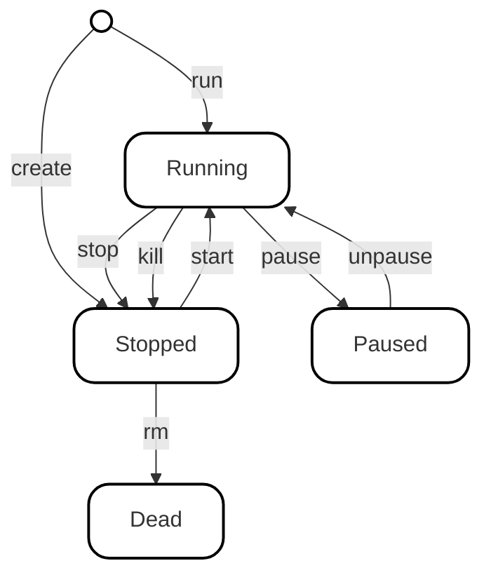

# Kurs Docker dla koła naukowego SOIP

Repozytorium zawiera materiały szkoleniowe oraz przykłady wykorzystania technologii Docker. Znajdziesz tutaj zarówno proste przykłady, jak i bardziej złożone konfiguracje aplikacji.

## 1. Czym jest Docker?
Na początek, aby wyrobić sobię intuicję, możemy porównać Dockera do narzędzi takich jak Virtualbox lub VMware.
Choć idea jest podobna, to jednak wykorzystywane mechanizmy i samo zastosowanie jest bynajmniej nieco inne. 
Docker to narzędzie realizujące koncepcję **wirtualizacji lekkiej**, czyli **konteneryzacji**. W odróżnieniu od klasycznych maszyn wirtualnych, kontenery współdzielą jądro (kernel) systemu operacyjnego maszyny hosta, tzn. procesy uruchomione w kontenerze pracują bezpośrednio w systemie operacyjnym hosta razem ze "zwykłymi" procesami. 

Architektura środowiska opiera się na modelu klient-serwer:
*   **Klienta (CLI):** Interfejsu, za pomocą którego wydaje się komendy.
*   **Serwera (Daemon):** Silnika działającego w tle, który zarządza kontenerami.

## 2. Jak pobrać Dockera?
Na komputerach z systemem Linux, dla większości dystrybucji można go zainstalować z użyciem menadżera pakietów danej dystrybucji.
Najprostszym sposobem instalacji na systemach Windows i macOS jest pobranie **Docker Desktop**.

Instrukcje dostępne są w oficjalnej dokumentacji:
*   Docker Engine - Linux: https://docs.docker.com/engine/install/
*   Docker Desktop - Windows, macOS, (również Linux): https://docs.docker.com/desktop/

## 3. Czym są obrazy?
Obraz to ustandaryzowany pakiet, w którym znajdują się binarki, biblioteki, pliki konfiguracyjne itp. Jednym słowem wszystkie zasoby których będzie potrzebował kontener do swojego działania. 

Dwie istotne cechy obrazów:
1. Niemutowalność, po uruchomieniu kontenera możemy zmodyfikować jego zawartość (kontenera), jednak nie wpłynie to na zawartość samego obrazu na podstawie którego został utworzony kontener. 
2. Obraz jest zbudowany z warstw. Pojedyncza warstwa to zmiana w systemie plików, t.j. dodanie, modyfikacja lub usunięcie pliku.

Tutaj można przeczytać trochę więcej:
*   https://docs.docker.com/get-started/docker-concepts/the-basics/what-is-an-image/
*   https://martinheinz.dev/blog/44

Obrazy pobierane są z rejestru obrazów. Domyślnym rejestrem jest *[DockerHub](https://hub.docker.com/)*.
Swoje rejestry posiadają m.in. duże organizacje jak np. GitHub (GHCR) i Oracle (OCR). 
Możemy także utworzyć swój prywatny rejestr, ale to jeszcze nie teraz.

Do zarządzania obrazami służy polecenie **docker image**. Znaczna część tych poleceń ma swoją skróconą formę, co jest charakterystyczne dla CLI Dockera. 

### Przykłady wykorzystania:

* **Pobieranie obrazu z rejestru.**
    W poleceniu podajemy nazwę rejestru, nazwę obrazu (repozytorium) oraz tag (wersję obrazu):
    ```bash
    docker image pull docker.io/ubuntu:latest
    ```
    W tym poleceniu możemy pominąć słowo kluczowe image, dodatkowo jeśli korzystamy z rejestru DockerHub i tagu (`latest`), możemy pominąć te wartości:
    ```bash
    docker pull ubuntu
    ```

* **Wyświetlanie pobranych obrazów.**
    Pokazuje listę obrazów dostępnych lokalnie na maszynie wraz z ich rozmiarami i identyfikatorami.
    ```bash
    docker image ls
    ```
    Wersja skrócona:
    ```bash
    docker images
    ```

* **Usuwanie obrazu.**
    Pozwala usunąć lokalny obraz, podając jego nazwę (unikalną, ew. z rejestrem i tagiem) lub ID. Obraz nie może być używany przez żaden (nawet zatrzymany) kontener.
    ```bash
    docker image rm alpine:3.24.1
    ```
    Wersja skrócona:
    ```bash
    docker rmi alpine:3.24.1
    ```
## 4. Zarządzanie kontenerami
Do zarządzania kontenerami służą polecenia z grupy docker container. Podczas wykonywania poleceń przedstawionych poniżej można pominąć słowo kluczowe container.  

Zanim omówimy te polecenia, wypadałoby przyjrzeć się schematowi przedstawiającemu cykl życia kontenera:



Choć z początku może to wyglądać nieco skomplikowanie jest to dosyć proste. Przeanalizujmy diagram po kolei. 

Aby uruchomić kontener należy wykonać polecenie **docker run** (skrócone docker **container** run). Gdy wszystkie procesy w uruchomionym kontenerze się zakończą przejdzie on ze stanu **Running** do **Stopped**, jednak domyślnie nie zostanie on automatycznie usunięty, Docker wciąż będzie przechowywał jego dane w pamięci, takie jak ID, nazwa (kontenera), nazwa jego obrazu itp...
W tej sytuacji możemy usunąć kontener na dobre poleceniem **docker rm** lub uruchomić go ponownie z użyciem **docker start**.

Polecenie **docker create** tworzy kontener ale go nie uruchamia, jak powyżej, można go wtedy włączyć poprzez **docker start**.

W przypadku gdy chcemy ręcznie zatrzymać pracę kontenera, możemy użyć polecenia **docker stop** lub **docker kill**.
Różnica polega na tym jaki sygnał zostanie wysłany do procesu/ów kontenera. W przypadku **docker stop** będzie to **SIGTERM**, który pozwoli na ewentualne obsłużenie tego sygnału przez proces (graceful shutdown). W przypadku **docker kill**, jak można się domyśleć zostanie wysłany sygnał **SIGKILL**, co będzie skutkowało bezwarunkowym ubiciem procesów.

Zatrzymanie kontenera (przejście do stanu **Stopped**) skutkuje zakończenim procesów i wyczyszczeniem ich pamięci. "Zapauzowanie" kontenera z użyciem **docker pause** powoduje jedynie zatrzymanie wykonywania procesów kontenera, zamiast ich całkowitego usunięcia. Po wznowieniu ich z użyciem **docker unpause** pracują one z powrotem z zachowaniem ich stanu przed zapauzowaniem.  

### Przykłady

* **Uruchomienie kontenera w trybie interaktywnym.**
    Flagi -i oraz -t odpowiadają kolejno za włączenie trybu interaktywnego i podłączenie pseudo-terminala do kontenera, co pozwala na wykonywanie poleceń powłoki wewnątrz kontenera. Kontener będzie miał nazwę "first" i zostanie utworzony na bazie obrazu ubuntu:26.04. Programem jaki zostanie w nim uruchomiony będzie /bin/bash, czyli powłoka.
    ```bash
    docker run -it --name first ubuntu:26.04 /bin/bash
    ```  

* **Uruchomienie kontenera w tle.**
    Flaga -d oznacza, że nie chcemy aby na naszej konsoli były wyświetlane komunikaty procesów kontenera. Flaga --rm natomiast, powoduje automatyczne usunięcie kontenera gdy przejdzie on do stanu **Stopped**, np. po zakończeniu pracy procesów lub ręcznym zatrzymaniu. 
    W sytuacji gdy nie podamy nazwy kontenera, zostanie ona wylosowana z pewnego zbioru przymiotników i rzeczowników.
    ```bash
    docker run -d --rm ubuntu sleep 3600
    ```

* **Utworzenie kontenera bez uruchamiania.**
    Jak wiemy, możemy to zrealizować z użyciem **docker create**. W poniższym przykładzie tworzymy kontener, z którym będziemy mogli się połączyć poprzez terminal. 
    ```bash
    docker create -it --name rezerwowy ubuntu:26.04 /bin/bash
    ```

* **Uruchomienie poprzednio utworzonego kontenera i jedna uwaga.** 
    Idąc powyższym tokiem myślenia, chcąc uruchomić kontener w tle, zamiast -it użyjemy flagi -d. I tutaj pojawia się problem, ponieważ **docker create** nie posiada takiej opcji.
    Uruchomienie kontenera w tle ma sens dla polecenia **run**, ponieważ jak wiemy może ono również wyświetlać dane wyjściowe z kontenera. W przypadku **create** nie ma to sensu, ponieważ utworzony kontener musimy następnie uruchomić poprzez **docker start**, a to polecenie zwraca tylko nazwę kontenera (lub jego ID w zależności jak się do niego odwołamy), nie wyświetla ono żadnych komunikatów z wewnątrz tego kontenera.
    ```bash
    docker start rezerwowy
    ```  

* **Zarządznie kontenerami - reszta poleceń.**
    Pozostałe polecenia do zarządzania cyklem życia kontenera, wymienione na diagramie są używane poprzez odwołanie się do nazwy lub ID kontenera.<br>
    Zatrzymanie kontenera:
    ```bash
    docker stop rezerwowy
    ```
    Odpauzowanie kontenera (ID):
    ```bash
    docker unpause ed559ec53380
    ```

* **Wykonywanie poleceń z zewnątrz/wewnątrz kontenera (Zależy jak spojrzeć).**
    Aby móc wydawać polecenia wewnątrz kontenera nie musimy być z nim połączeni cały czas poprzez terminal (tryb interaktywny). Z użyciem docker exec możemy wykonać wybrane polecenia wewnątrz kontenera który jest uruchomiony w tle. Podajemy nazwę kontenera a następnie komendę jaką chcemy w nim wykonać.
    ```bash
    docker exec podgladany ls -l
    ```

* **Wyświetlanie kontenerów.**
    W tym celu możemy wykorzystać polecenie **docker ps**, alternatywnie możemy użyć **docker container ls** które jest aliasem do **ps** (nie jedynym), przyczym pierwsza opcja jest częściej używana. Flaga **-a** powoduje wyświetlenie wszystkich utworzonych (nieusuniętych) kontenerów, pominięcie jej wyświetli tylko pracujące (Running).
    ```bash
    docker ps -a
    ```

* **Wyświetlanie procesów.**
    Polecenie **docker top** pozwala wyśwtielić informacje o procesach wewnątrz danego kontenera z perspektywy systemu operacyjnego.
    W stosunku do perspektywy z wewnątrz różnicę będzie widać m.in. w numerach PID.
    ```bash
    docker top podgladany
    ```

* **Wykorzystanie zasobów.**
    Polecenie **docker stats** wyświetla podstawowe informacje o zasobach wykorzytywanych przez poszczególne kontenery, takich jak np. czas procesora i wykorzystanie pamięci RAM. Gdy podamy nazwę kontenera, zobaczymy statystyki tylko dla niego.
    ```bash
    docker stats
    ```
* **Wykorzystanie dysku.**
    Jak już mogliśmy zauważyć, wiele poleceń z CLI Dockera nawiązuje do nazw linuxowych coreutils. Nie inaczej jest w tym przypadku. Polecenie **docker df** pokazuje wykorzystanie przestrzeni dyskowej przez środowisko Docker.
    ```bash
    docker system df
    ```

* **Zwalnianie miejsca.**
    W sytuacji gdy chcemy posprzątać nasz system poprzez usunięcie nieużywanych obrazów i zatrzymanych konterów oraz paru innych rodzajów danych o których jeszcze zdążymy wspomnieć.
    ```bash
    docker system prunne
    ```

# C.D.N.